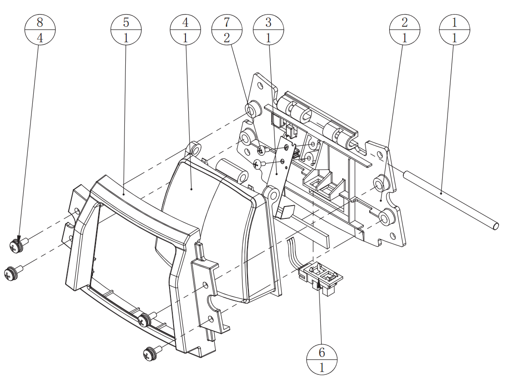

# maimai 维护手册

此文章记录了我在维护 maimai 过程中积累的经验。文章内容可能有错误，请不吝指正。

## 1. 按键的组成

按键，是指整个 **拍击按键组件**。拍击按键组件的结构如下图所示，图中圆形标识上方的数字是组件编号，下方的数字是数量。

### 1.1. 按键盖

**按键盖**（也叫 **按键外壳**，图中编号为 4）是拍击按键组件最主要的结构，在官方说明书中被称为“开关按键”。它负责：

* 传递、分散按压力；
* 限制弹片运动，防止弹片超程按压；
* 扩散按键灯光。

按键盖在 **按键轴**（图中编号为 1，官方说明书中称为“开关按钮轴”，金属制）的固定下轴向旋转。按键盖上有三个轴环，包含正中央的一个 **主轴环** 和两侧的两个 **副轴环**。

由于原装按键盖比较脆弱，在高强度使用下，可能会在数月到一年左右碎裂。这属于正常损耗，并不一定是某一次大力击打直接导致的结果。

通常情况下，副轴会先损坏。副轴损坏后，一般只会增加按键盖晃动，对输入影响较小；而主轴损坏后，则可能导致按键盖明显松动甚至脱落，严重影响使用。

因此，如果要节约成本，则会在

* 两个副轴均损坏，或
* 主轴损坏

时，再更换新的按键盖。

按键盖内部有一个与弹片接触的横梁，其高度经过专门设计，过高或过低都会影响输入效果。详见[第三节](#3-按键问题维修)。一些非原装按键盖可能会出现这个问题，但多数情况下可以通过调节弹片来进行补偿。

此外，还需要注意按键盖尺寸是否与框体匹配。部分渠道仍在售卖旧框按键盖，其尺寸相比 DX 按键盖更小。虽然能够安装到 DX 框体上，但会明显影响输入效果。

按键盖的材质、质量与密度，也会对按键手感和拍击声音产生一定影响。

### 1.2. 弹片

**弹簧片**（简称 **弹片**，图中编号为 3）是拍击按键组件的核心结构，也是对按键性能和手感影响最大的结构。它在官方说明书中被称为“开关弹簧”。

弹片由 **固定臂** 与 **触发臂** 两部分组成。

弹片上最大的平面称为固定臂，其上半部分被固定在 **按键底座**（图中编号为 2，官方说明书中称为“开关金属盘”）上，下半部分则能够在一定范围内弹性运动。

除固定臂平面外，弹片还由另外两个平面组成，它们都属于触发臂。其中与感应器方向一致、用于遮挡红外信号的部分称为 **遮光片**。

当按键被按下时，遮光片会伸入感应器中，从而产生输入信号。

#### 1.2.1. 弹片的预变形

**预变形（pre-deformation）** 是指固定臂在未按压状态下相对于平直标准位置产生的初始偏移量，也就是弹片的“弧度”。通常表现为向内或向外的偏移：

* 向内偏移：固定臂向按键内部方向弯曲；
* 向外偏移：固定臂向按键外侧方向反弯。

**预变形主要影响按键的手感表现，包括按压阻力、回弹力度以及击键声音。**

**除此之外，当固定臂向内侧的偏移量超过某一临界值后，按键盖将不被完全顶起，总行程会相应减小。这会严重影响按键的回弹性能和输入效果。**详见 [第三节](#3-按键问题维修)。

弹片预变形越向外偏移，按键通常越硬、回弹感越强；越向内偏移，按键越软、回弹感越弱。但值得指出的是，弹片的预变形对触发行程的影响很小。详见 [第二节](#2-键程)。

<!-- 通过调整预变形向外偏移来调硬按键，会增强按键的回弹，一定程度上会缓解震键。 -->

新弹片通常没有偏移，接近平直状态。一般来说，并不需要对新弹片的预变形做明显调节。如需调节按键软硬和回弹力度，也应仅做极小幅度调整，使之看不出明显的弧度。

对于某些材料比较脆弱的弹片，过度的弯折可能会显著减少其寿命。

由于材料老化，部分弹片在长期使用后会出现预变形缓慢向内偏移的现象，以致按键变软、回弹感变弱。这是弹片老化的常见表现之一。

#### 1.2.2. 弹片的折弯角

**折弯角（Bending Angle）** 是指弹片固定臂与触发臂连接处形成的 L 形夹角。折弯角主要影响触发臂的空间位置，从而影响按键判定状态，但通常不会直接改变按键手感。

新弹片的折弯角大多是直角。

折弯角决定了

* 遮光片与感应器之间的初始距离；
* 遮光片伸入感应器的面积。

因此，它是影响输入判定最关键的参数之一。

折弯角越小，

* 遮光片越靠近感应器，
* 遮光片伸入感应器的面积越大，
* 触发行程越小，
* 更容易提前触发、误触发、输入抖动；

折弯角越大：

* 遮光片越远离传感器；
* 遮光片伸入感应器的面积越小；
* 触发行程越大；
* 需要更深按压才能触发，更容易输入丢失。

许多“吃键”与“震键”问题，本质上都与遮光片与感应器之间的初始距离不当有关，可以通过改变折弯角来解决。

折弯角过大时，遮光片伸入感应器的面积很小，并且是“斜切”，不易形成稳定的遮光区域，因此“吃键”等问题的概率会显著提高。

多数情况下（尤其是使用原装按键和弹片的情况下），保持折弯角为直角时输入效果是最好的。

对于材料较脆弱的弹片，用力调节折弯角可能会使其断裂。

由于材料老化，部分弹片在长期使用后会出现折弯角缓慢回弹的现象，即折弯角逐渐向直角方向变化，以致按键判定状态。这是弹片老化的常见表现之一。

#### 1.2.3 弹片的遮光片

用右手横着拿弹片末端（固定端），使遮光片平面靠近自己。遮光片最下端到固定臂平面的距离称为 **遮光片高度**。

遮光片高度同样决定了

* 遮光片与感应器之间的初始距离。

因此，调节遮光片高度和调节折弯角有着类似的效果，即遮光片高度越大，

* 遮光片越靠近感应器；
* 更容易提前触发或误触发；

遮光片高度越小，

* 遮光片越远离传感器；
* 需要更深按压才能触发。

遮光片高度对遮光面积的影响相对较小，且可调范围有限，调节难度较高，也更容易损伤弹片；然而，遮光片高度不易随着材料老化而发生明显变化，因此其长期稳定性优于折弯角。

遮光片通常并不紧贴着固定臂，他们之间有一段空隙。如果弯折弹片触发臂，使这段空隙缩小，那么 **遮光片长度** 就会相应地增加。

与折弯角一样，遮光片长度决定了

* 遮光片与感应器之间的初始距离；
* 遮光片伸入感应器的面积。

遮光片长度越大，

* 遮光片越靠近感应器，
* 遮光片伸入感应器的面积越大，
* 更容易提前触发或误触发；
  
遮光片长度越小，

* 遮光片越远离传感器，
* 遮光片伸入感应器的面积越小，
* 需要更深按压才能触发。

调节折弯角，实际上也是在调节 **遮光片的有效长度**。因此，调节遮光片长度与调节折弯角的原理很像。但是，调节遮光片长度不会形成“斜切”，更不容易出现输入丢失的问题；而且，遮光片长度不易随着材料老化而改变，其长期稳定性优于折弯角。

由于调节遮光片长度同样具有较高难度，因此在所需调节量较小时，通常优先通过调整折弯角进行微调。这种方法操作相对简单，且对遮光面积的调节精度较高。

当所需调节量较大时，通常会选择调整遮光片长度，以获得更稳定的调节效果。

#### 1.2.4. 弹片的老化

弹片在长期使用后会产生以下问题：

* 回弹迟滞，手感发“肉”；
* 折弯角和预变形改变，触发一致性下降；
* 弹片震荡，导致输入异常。

华立代理的较旧的舞萌 DX 机台出厂配置钢制弹片，而新版华立机台和日版机台配置铜制弹片。

相比之下，铜制弹片通常具有：

* 更轻的触发手感；
* 更灵敏、更跟手的主观反馈。

因此，很多玩家会认为日版机台的手感更好。

但铜制弹片更加柔软，也更容易疲劳与氧化，其寿命通常明显短于钢制弹片。

在高强度使用环境下，

* 钢制弹片通常可稳定使用一至两年以上；
* 铜制弹片根据铜合金类型不同，寿命也会有不同，多数在数月后就有手感差异，半年后便可能出现明显老化。

空气湿度较高时，铜弹片老化速度通常会进一步加快。

#### 1.2.5. 弹片的调节

多数铜弹片非常柔软且脆弱，调节时要避免大幅度弯折，否则可能直接产生裂纹甚至断裂。

调节弹片预变形和折弯角时，应仅施加极小力度，因为极小力度就能留下形变。

此外，安装与调节弹片时，**必须佩戴干燥手套**。残留在弹片表面的汗液或油脂会很大程度地加快弹片的老化。

调试弹片预变形、折弯角等参数时，应先将弹片从机台上拆下后再进行调整，不应在安装状态下直接掰动弹片，否则弹片会受到固定结构的限制，难以精确观察和控制调整量，同时容易在固定端附近产生过大的局部应力，增加弹片变形、开裂或断裂的风险。

在调试、安装完弹片之后，安装并固定好

* 按键盖、
* 按键轴（图中编号为 1）、
* 限位框（图中编号为 5）

之前，请勿直接按压弹片或按键盖进行测试。

这是因为，在结构未完全安装时，人为施加的弹片运动很可能超出设计范围（超程按压），从而改变触发行程或造成额外疲劳。

测试按键时，应至少安装好按键盖与限位框，再通过正常按键方式进行测试。

此外，无论何时，都不应主动拨动弹片使其震荡；也不要在未安装限位框时拨动按键盖，否则，按键盖与弹片可能共同产生额外震荡。这会对弹片寿命造成影响。

#### 1.2.6. 弹片的固定

弹片通过两颗 *M3×8* 规格的大扁头自攻螺丝固定在底座上。弹片的固定状态不仅关系到安装是否牢固，也会对弹片的实际工作状态产生一定影响。

安装弹片时，应以“**刚好固定不松动**”为标准，不必追求压紧感。

如果螺丝拧得过紧，可能会造成以下问题：

* 底座塑料结构受力开裂（这是不可逆的，只能更换底座）；
* 弹片被强行压变形，影响正常弯曲路径。

需要特别强调的是，固定弹片的底座塑料非常脆弱，拧螺丝时请多加留心。

安装弹片时，请 **不要使用电动螺丝刀**（除非你的电动螺丝刀能精准调整锁付力度）。

螺丝也不能过松。当螺丝固定不充分时，会导致

* 弹片整体存在轻微位移；
* 弹片颤动。

### 1.3. 限位框

按键盖限位框（图中编号为 5）是位于按键盖外侧、用于限制按键盖位移的结构，俗称“方形框”，官方说明书中称为“开关遮光板”。

它能够限制按键盖的水平移动，保证按键盖只进行垂直运动；顾名思义，它还能限制按键灯光的扩散，保证案件灯光指照射到按键盖上。

限位框的尺寸需要同时匹配

* 底座，
* 按键轴，
* 按键盖。

若限位框的尺寸相对于按键盖过大，则可能导致按键晃动，对按键手感和输入稳定性都有影响。

这也是为什么不建议在 DX 框体上使用旧框按键盖。

### 1.4. 感应器

感应器（图中编号为 6）俗称“光眼”，本质上属于光电传感器（Photoelectric Sensor）。

其工作原理类似于对射式光电开关：

* 感应器内部持续发射红外信号；
* 遮光片进入感应区域后阻断信号；
* 系统据此判断按键输入。

当按键按下时，弹片带动遮光片进入感应器内部，从而产生输入判定。

感应器本身寿命通常较长，实际故障更多来自：

* 灰尘堆积或污渍污染；
* 结构松动和偏移。

### 1.5. 按键轴

---

## 2. 键程

“键程”在维护语境下通常需要拆分为两个不同的概念来讨论：**总行程** 与 **触发行程**。

二者在日常中经常被混用，但本质并不相同。

### 2.1. 总行程

**总行程（Total Travel）** 是指按键从静止位置移动至触底位置所经过的总位移距离。

在弹片预变形处于正常状态的情况下，按键的上方行程限制（上限位）由按键盖与限位框之间的结构关系决定，底部行程限制则由底部结构止挡控制。这种情况下，按键的总行程是一定的，可定义为 **限位框下端面到底座上端面的距离，减去按键盖外边缘的厚度**。

在实际维护中，如果弹片预变形向内偏移大于某一临界值，也可能出现按键盖在静止状态下并未完全贴近限位框的情况。此时，上方限位并不会立即参与限制，按键在初始阶段会存在一定“自由间隙”。

在这种状态下，按键的有效总行程会相应减小，手感上也会相对更轻；但可能会严重影响按键的回弹性能和输入效果。

当按键的总行程已达最大时，调节弹片预变形向外偏移，会继续增加按键的触发力度，在主观感受上可能认为键程变长。因此，日常讨论的键程有时也指按键的触发力度。

### 2.2. 触发行程

触发行程（Actuation Travel）指按键从静止位置移动至判定触发位置所经过的位移距离，本质上由弹片的遮光片进入感应器有效遮光区域的位置决定。触发行程包含在总行程之内。

触发行程受以下多个因素影响：

* 弹片的折弯角和遮光片的长度、高度带来的遮光片初始位置偏移；
* 弹片预变形带来的按键总行程变化（如果总行程未达到最大）；
* 感应器的空间位置；
* 按键盖横梁的高度。

以上所有因素本质上都是通过改变遮光片与感应器之间的相对位置关系，进而改变感应器被遮挡的时机，从而影响触发行程。

触发行程是实际维护中最关键的参数之一，直接影响“轻轻按下就出发”还是“拍到底才触发”等现象。

一般来说，按键的触发行程在总行程的 40% 到 60% 左右为宜，如果触发行程小于 1.6 mm 则会导致输入抖动，过大则容易导致输入丢失（尤其是调节折弯角时）。详见 [第三节](#3-按键问题维修)。

### 2.3. 键程调节

#### 2.3.1. 触发行程调节

所谓键程调节，通常指的都是调整触发行程。**而调节触发行程的关键是调节遮光片与感应器之间的相对位置关系**，最常见的是调节折弯角。

通常情况下，

* 折弯角越小，触发点越提前，触发行程越短；
* 折弯角越大，越需要深按压才能触发。

调节时应遵循“小幅、多次”的原则。

铜弹片尤其脆弱，过度弯折可能导致永久形变甚至裂纹。

如果具备更专业的调节能力，可以通过调整遮光片长度和高度来调节触发键程。但这对弹片材料的塑性要求较高；对于塑性较差的弹片，容易出现断裂等问题。一般只有特定材料的铜弹片能够较好地胜任这种调节方式。

#### 2.3.2. 触发力度调节

如果所说的键程指的是按键触发力度或总键程，则要调节的是弹片的预变形。

通常情况下，弹片预变形

* 越向内偏移，按键触发力度越小，甚至会缩短总键程；
* 越向外偏移，按键触发力度越大，但不会扩大总键程。

---

## 3. 按键问题维修

按键问题通常可分为两类：

* 输入丢失（Input Loss）
* 输入抖动（Input Chatter）

其中，“震键”是玩家间对输入抖动的常见俗称。虽然这一说法并不严格，但由于使用广泛，本文仍会沿用这一称呼。

### 3.1. 输入丢失

输入丢失俗称“吃键”，是指玩家完成了按压动作，但机器未检测到输入信号。这个问题的本质通常都是：

> 遮光片未在感应器的有效遮光区域内形成稳定遮挡状态。

#### 3.1.1. 折弯角过大

折弯角过大会导致触发行程过长，尤其是在“打大歌”时更容易出现问题。

在这种状态下，遮光片进入光路的位置整体后移，输入判定点被推迟，因此即使按键已经产生明显的机械触底感，也可能尚未进入有效触发区域。

这是最常见的原因之一，通常表现为：

* 触发行程长；
* 拍歪和拍轻时会丢失输入；
* 快速输入时问题尤其明显；
* 判定“LATE”偏多。

该原因造成的输入丢失通常是均匀的，即发生率相对稳定，且问题出现并不持续。请检查按键的触发行程，来判断是否为此类问题。

#### 3.1.2. 感应器污染

灰尘或污渍影响红外信号稳定性，特征是“偶发、不稳定”，但问题出现时持续时间较长。可能与输入抖动同时出现。

#### 3.1.3. 感应器故障

感应器因故障在一段时间内不发射或接受红外信号时，按键将一直处于“ON”状态，从而表现为输入丢失。

#### 3.1.4. 按键盖预压

即总键程过短。这可能是弹片长期使用后产生被动预变形导致的。这种情况下，按键盖存在轻微的“常驻下压”，遮光片初始位置已经接近触发边界，可能与输入抖动同时出现。

出现这个问题时应调节弹片预变形向外偏移，使按键盖与限位框接触。

#### 3.1.5. 按键盖结构异常

横梁高度不合适，导致按压深度不足。错误使用旧框按键盖或自制按键盖时会出现此问题。请更换合适的按键盖或调节弹片折弯角。

### 3.2. 输入抖动

输入抖动俗称“震键”，是指一次按压识别为多次输入，通常表现为连续击打时意外出现“GOOD”或“GREAT”判定。

按压按键时，弹片会发生主动的弯曲形变，从而使遮光片进入感应区域。在松开按键后，弹片会不可避免地产生一定程度的回弹振荡，这种振荡在结构上属于正常的阻尼衰减过程。

在触发行程较大的情况下，遮光片已经退出相对稳定的遮挡区域，弹片的微小振动不会改变光路的遮挡状态，因此不会影响判定结果。

但当触发行程过小时，情况会发生变化：

此时遮光片刚退出光电感应器的临界遮挡区域，弹片回弹过程中产生的微小振荡，会带动遮光片在“刚好触发与刚好未触发”的边界之间反复移动，从而导致信号在 ON / OFF 状态之间切换，这样就产生了输入抖动。

简单来说，触发行程过小时，微小机械波动被放大了为输入状态切换。因此，**绝大多数的输入抖动都与触发行程过小有关。**

输入抖动的具体原因又可以分为以下几种：

#### 3.2.1. 折弯角过小

遮光片过于接近感应临界位置，导致触发行程过小，进而出现输入抖动。通常伴随判定“FAST”偏多。

#### 3.2.2. 弹片疲劳

老化后的弹片更容易产生不稳定震荡，从而产生输入抖动。这是“震键”一词的由来。遇到此问题请更换新的弹片。但实际上，这个问题出现的频率远低于折弯角问题的。

#### 3.2.3. 感应器污染或松脱

灰尘或污渍影响红外信号稳定性，特征是“偶发、不稳定”。另外还要检查感应器是否正确固定在底座上，如果松动、掉落会导致触发行程减小，进而出现输入抖动。

#### 3.2.4. 按键盖预压

即总键程过短。这可能是弹片长期使用后产生被动预变形导致的。这种情况下，按键盖存在轻微的“常驻下压”，遮光片初始位置已经接近触发边界，可能与输入丢失同时出现。

出现这个问题时应调节弹片预变形向外偏移，使按键盖与限位框接触。

#### 3.2.5. 按键盖结构异常

横梁高度过高，导致按键的触发行程减小，进而出现输入抖动。使用自制按键盖时可能会出现此问题。请更换合适的按键盖或调节弹片折弯角。

### 3.3. 输入时序偏移

简单来说，就是判定稳定地偏向“LATE”或“FAST”。这分别是触发行程过长或过短导致的，调节弹片的折弯角即可。另外，较轻的按键盖也可能产生“FAST”更多的感觉。

## 4. 触控维护

### 灵敏度

（待补充）

### 触控问题维修

（待补充）

---

## 杂项

### 无法连接到照相机

（待补充）
